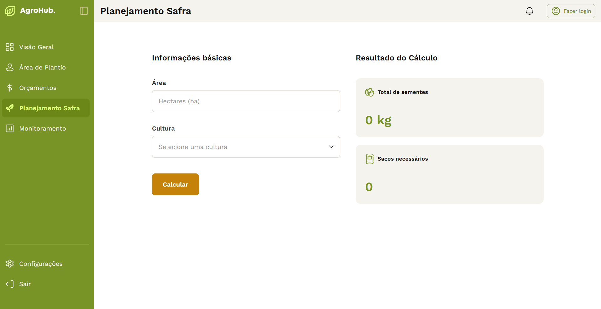

# 🌾 AgroHub - Calculadora de Insumos Agrícolas

<p align="center">
  
</p>

O **AgroHub** é uma ferramenta desenvolvida para auxiliar agrônomos no campo a calcularem, de forma rápida e precisa, a quantidade de sementes necessária para o plantio, baseando-se na área total (em hectares) e na cultura escolhida.

---

## 🚀 Funcionalidades

- **Cálculo Inteligente**: Calcula o peso total em KG e a quantidade de sacos necessários (com arredondamento automático para cima).
- **Validação de Dados**: Sistema de feedback para campos vazios ou valores inválidos.
- **Navegação Fluida**: Sidebar interativa com estados ativo/inativo e suporte a modo colapsado.
- **Totalmente Responsivo**: Experiência otimizada para Desktop, Tablets e Mobile (com menu lateral flutuante).

---

## 🛠️ Tecnologias Utilizadas

Este projeto foi construído utilizando as melhores práticas de desenvolvimento moderno:

- **React.js**: Biblioteca principal para construção da interface declarativa.
- **CSS Modules**: Para escopo de estilos, garantindo que as classes não sofram interferência global.
- **React Router Dom**: Gerenciamento de rotas e navegação.
- **HTML5 Semântico**: Uso rigoroso de tags como `<nav>`, `<ul>`, `<li>`, `<dl>`, `<dt>` e `<dd>` para SEO e acessibilidade.
- **Google Fonts (Work Sans)**: Implementação de um sistema tipográfico consistente.

---

## 💎 Diferenciais Técnicos (O que observar no código)


1.  **Arquitetura de Componentes**: Separação clara entre componentes de layout (Sidebar, Header) e componentes de UI (CardCalculadora, InputArea), facilitando a manutenção.
2.  **Design System**: Criação de um `index.css` robusto com variáveis CSS (`:root`) e uma escala tipográfica padronizada para títulos e parágrafos.
3.  **UX Responsiva**: Implementação de um `useEffect` para monitorar o redimensionamento da tela e gerenciar o estado do menu mobile automaticamente.

---

## 📦 Como rodar o projeto

1.  Clone este repositório:
    ```bash
    git clone [https://github.com/seu-usuario/agrohub.git](https://github.com/seu-usuario/agrohub.git)
    ```
2.  Instale as dependências:
    ```bash
    npm install
    ```
3.  Inicie o servidor de desenvolvimento:
    ```bash
    npm run dev
    ```

---

## 📝 Regras de Negócio Aplicadas

| Cultura | Rendimento (kg/ha) | Tamanho do Saco (kg) |
| :--- | :--- | :--- |
| **Soja** | 45 kg/ha | 40 kg |
| **Milho** | 20 kg/ha | 20 kg |

---

Autor: Fabricio Fiss Bartz